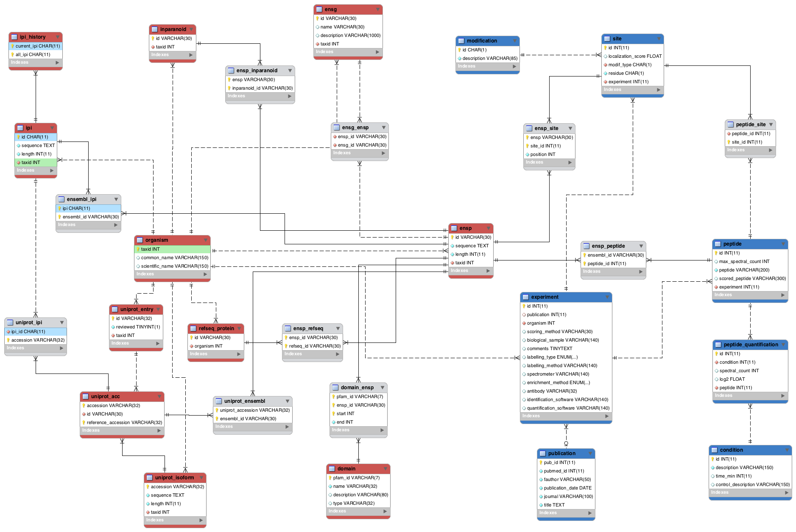

# ptmdb

This project contains all the necessary code to create and fill a
database of post-translational modifications. The database will
contain the quantitative and non-quatitative ptms available as well as
the necessary information to map it through different IDs.

* Requirements:

Check out the `Makefile` to be sure of the external databases
necessary to fill the database.

* Dependencies:

	* perl - *packages:* DBI, DBD::MySQL, LWP

	* R - *packages:* RMySQL, (devtools?)

This repository can act also as a submodule of other projects intended
to use the ptmdb.

 

### Setting up ptmdb

First, you must define the organisms that will be present in the
database in the `organism.csv` file.  This file consists of eight
tab-delimited fields:

    * the common name (i.e. "human")
    * the scientific name ("Homo sapiens")
    * the taxonomic ID ("9606")
    * the IPI ID ("ipi.HUMAN" or "NA" if it doesn't exist)
    * the Ensembl FTP master directory in which the species
      directories reside ("ftp://ftp.ensembl.org/pub",
      "ftp://ftp.ensemblgenomes.org/pub/plants", etc.)
    * the Ensembl proteome version ("GRCh37")
    * the Ensembl release number ("74")
    * the BioMart Database ("ENSEMBL GENES 74")

Next, you must define the classes of post-translational modifications
that will be stored in the database in the `modifications.csv` file.
This is a two-column, tab-delimited file consisting of the
modification abbreviation ("P") and its full name ("Phosphorylation").

You must also create the database itself and to grant privileges to a
user.  Be sure to set the user and database information inside the
`Makefile`.

Setting up the database tables and populating them with the proteomics
data are handled via the `Makefile`.  If your `organism.csv` and
`modifications.csv` files are correct, simply running `make` will
automate the whole process.  This process can be broken down into
individual steps as follows:

    make create-tables modifications xml-queries parse-histories proteomes insert-species

Thus, to only download the proteomic data, run `make proteomes`.

To silence some of Make's output, run it with the `-s` option.  To
parallelise some of the processes, use the `-j` option (i.e. `-j4`
runs four parallel processes).

### ptmdbR

ptmdbR has been created as a subproject of ptmdb and serves as an
interface between the database and R. Some of the most frequent
actions such as connecting with the database or querying its content
are implemented as simple functions. This framework should be useful
when asking higher order questions.

#####Using ptmdbR

Integrating ptmdbR on your on project is extremely easy. You just have
to invoke the library from the proper path:

	library(ptmdbR, lib.loc="<path to the libraries parent directory>")

#####Updating ptmdbR

To add or modify ptmdbR functions, you can find the code for the whole
package under `src/ptmdbR/src`. Note that the package code is
commented using
[roxygen2](https://github.com/yihui/roxygen2). roxygen2 allows to
produce the documentation for the different functions. Be kind a keep
using it.

Once the code has been modified it's necessary to generate the updated
documentation and build the package. In order to simplify this step,
you can just run `make ptmdbR` in the main directory and the
compiled `ptmdbR` package will be created in the location specified
by `PTMDBRLIBLOC` in the `Makefile`.
